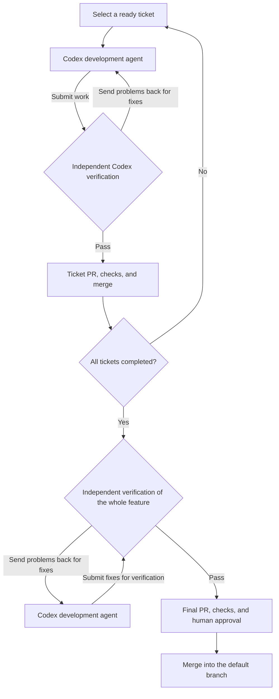
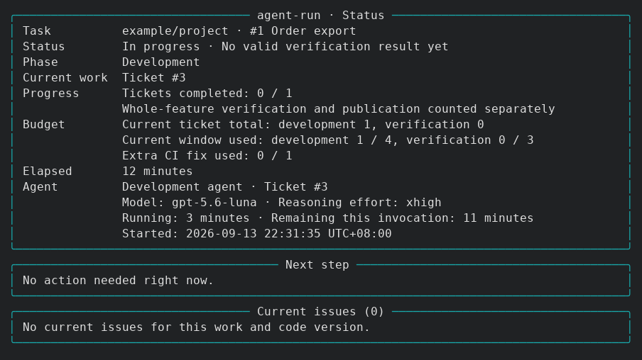
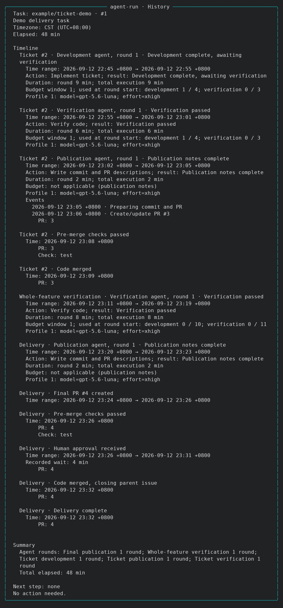

# grill-engineering

English | [简体中文](README.zh-CN.md)

After [Matt Pocock Skills](https://github.com/mattpocock/skills) breaks your work into GitHub tickets,
grill-engineering runs Codex to implement and verify them, with less manual coordination between tasks.

[Get started](#get-started) · [Screenshots](#screenshots) · [Agent guide](docs/agent-guide.en.md)

## Why I built this

Matt's `grill-me` and `grill-with-docs` help work through an idea. `to-spec` and `to-tickets`
turn it into a spec and tickets on GitHub. During development, two problems remain:

1. Someone still has to keep the work moving: start the next ticket, follow up on fixes, and handle PRs and merges.
2. An agent can report completion while leaving bugs, missing requirements, or breaking existing behavior. Its work needs to be checked.

## How grill-engineering works

The `agent-run` command runs Codex to implement the tickets in dependency order. A separate Codex agent
checks the results against the requirements and sends any problems back to the development agent.
Implementation, verification, and fixes run in a loop, managed by the program.

Once the requirements, tickets, and environment are ready, run this in the target repository:

```bash
agent-run run <parent-issue> --repo OWNER/REPO
```

The main workflow:



Individual tickets can look correct while the combined feature still fails. After all tickets are
integrated, another agent checks the whole feature against the original requirements. Any problems
go back to a development agent for fixes and another verification pass.

When human input is needed, the run pauses and saves its work. The final PR is merged into the default
branch after the maintainer reviews and approves it. See the [run reference](docs/agent-run.md) for
execution and recovery details.

## Screenshots

`status` shows what is running and whether anything needs attention. Here is an example task:



`history` shows the time spent on each development and verification round, along with PR checks and merges.

<details>
<summary>View the history of a real test run</summary>



</details>

The run keeps going after the terminal closes. Use `stop` to pause it and preserve the work,
and `resume` to continue later.

## Get started

Give your agent the following prompt with your repository path and parent issue URL.
The [agent guide](docs/agent-guide.en.md) covers installation, setup, and running tasks.

```text
Read https://github.com/GRD-Chang/grill-engineering/blob/main/docs/agent-guide.en.md.
Install agent-run, check that this repository and its GitHub tickets are ready, then start the run.
Repository path: <local path>
Parent issue: <GitHub issue URL>
Let me know when you need input or approval for the final PR.
```

The current backend is Codex CLI with GitHub, running on Linux. Your agent can follow the guide to
install and configure it. Runs use your Codex account quota; models and repair limits can be adjusted
through [user settings](docs/user-defaults.md).

For Matt's workflow, see the [upstream guide](https://www.aihero.dev/skills).

## Acknowledgments

This project draws on ideas from [ClawSweeper](https://github.com/openclaw/clawsweeper). Thanks to its contributors for sharing their work.

## License

[MIT](LICENSE).
