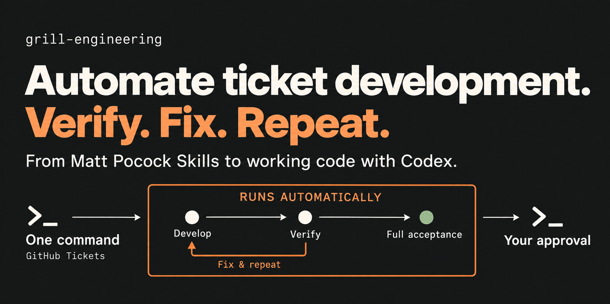
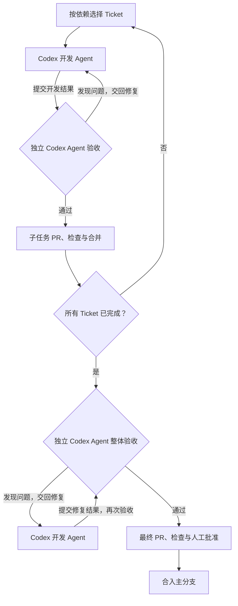
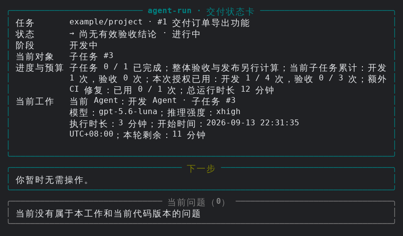
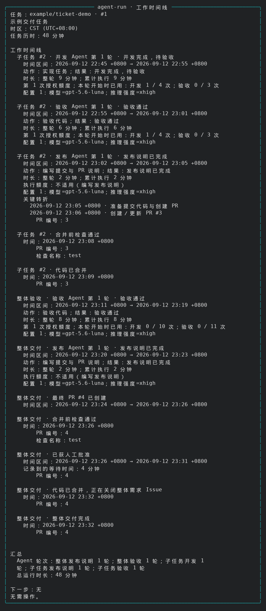
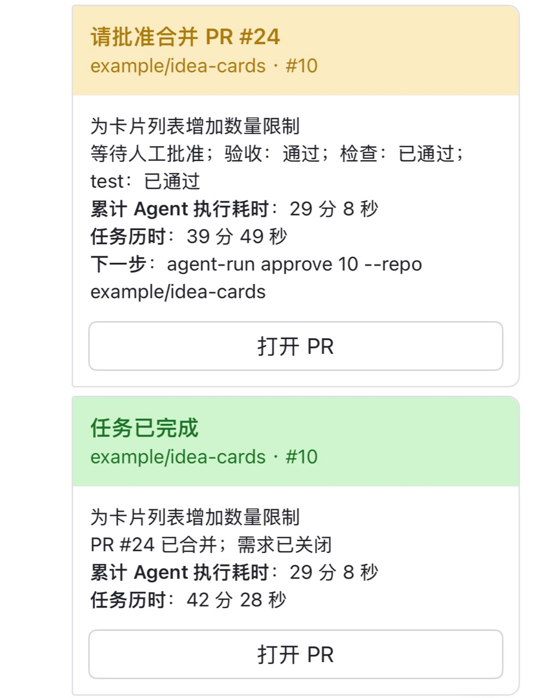
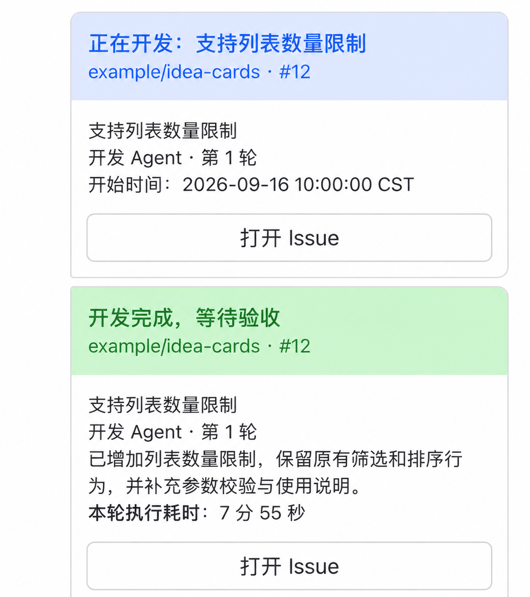
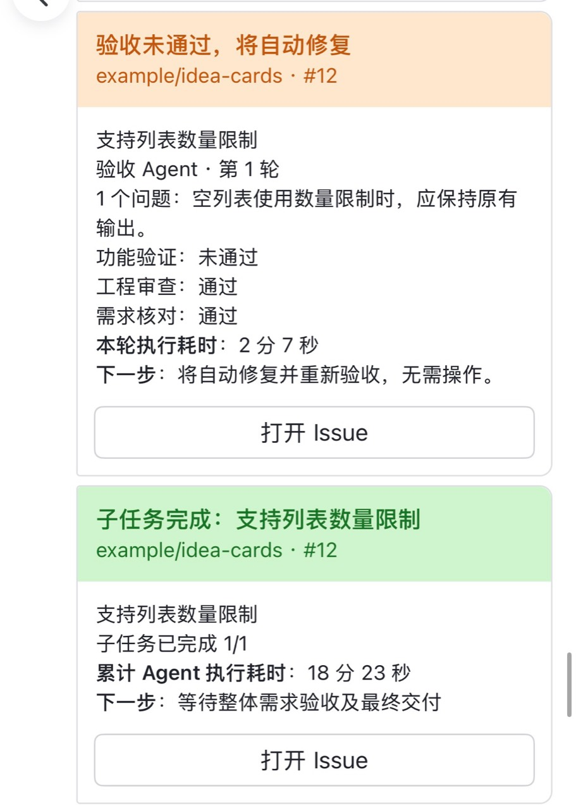

# grill-engineering

[English](README.md) | 简体中文



用 [Matt Pocock Skills](https://github.com/mattpocock/skills) 拆好 GitHub Tickets 后，
agent-run 自动调用 Codex 完成开发和验收，减少逐个任务手动推进的工作。

[安装和使用](#安装和使用) · [运行截图](#运行截图) · [飞书通知](#飞书通知) · [Agent 操作指南](docs/agent-guide.md)

## 为什么做这个

用 Matt 的 `grill-me`、`grill-with-docs` 讨论需求，再通过 `to-spec`、`to-tickets`
把任务拆到 GitHub 上以后，实际开发中还有两个问题：

1. 任务拆好了，仍需要人工逐轮推进开发，跟进修复，再处理 PR 和合并。
2. Agent 开发的结果不一定正确。即使报告完成，也可能有 bug、遗漏需求，或者改坏原有功能，需要另外检查。

## grill-engineering 怎么做

agent-run 把拆好的任务交给 Codex 自动推进，减少人工安排下一张任务、跟进修复和合并的工作。
同时，它会单独调用 Codex 做验收，检查开发结果是否符合需求，把发现的问题交回开发 Agent 修复。
开发、验收、修复和复验因此可以自动循环进行。

确定需求和任务拆分、完成环境配置后，在目标仓库执行：

```bash
agent-run run <parent-issue> --repo OWNER/REPO
```

下面是主要流程：



每个 Ticket 单独完成，不代表合在一起就能正常工作。所以最后还会对照最初的需求，
验收整个功能。发现问题后，同样交回开发 Agent 修复，再验收修复结果。

需要人工处理时，任务会暂停并保存已有工作。最终 PR 由维护者审阅和批准后合入主分支。
具体的运行和恢复规则见[运行说明](docs/agent-run.md)。

## 运行截图

用 `status` 看现在做到哪了、有没有问题需要你处理。下面是一个示例任务的终端画面：



`history` 可以回看每轮开发、验收用了多久，以及 PR 检查和合并的记录。

<details>
<summary>查看一次真实测试任务的 history</summary>



</details>

运行期间可以关掉终端，之后再回来查状态。如果想让任务停下来，需要用 `stop`；
程序会保存现场，之后可以用 `resume` 继续。

## 飞书通知

不用一直打开终端查看进度。启用飞书通知后，子任务完成、需要你补充信息或批准最终 PR 时，
会收到消息；整个任务完成后也会通知你。

默认使用精简模式，只发送关键进展和需要人工处理的消息。想了解每轮开发、验收和自动修复的过程，
可以切换到详细模式。卡片会显示已有的工作摘要和执行耗时，并提供对应 Issue 或 PR 的链接。

<p align="center">
  
</p>

<details>
<summary>查看详细模式下的开发、验收与修复通知</summary>

详细模式会显示每轮开发的开始时间、完成摘要和执行耗时。

<p align="center">
  
</p>

验收发现问题时，还会显示问题和接下来的自动修复安排。

<p align="center">
  
</p>

</details>

飞书通知为可选功能，默认关闭，配置方法见[飞书通知说明](docs/notifications.md)。

## 安装和使用

安装和使用的具体步骤写在 [Agent 操作指南](docs/agent-guide.md)里。
把下面这段话交给你的 Agent，填上项目路径和总任务的 Issue 链接即可：

```text
请阅读 https://github.com/GRD-Chang/grill-engineering/blob/main/docs/agent-guide.md，
帮我安装 agent-run，检查这个仓库和 GitHub Tickets 是否可以运行，然后启动任务。
目标仓库路径：<本地路径>
总任务（Parent Issue）：<GitHub Issue URL>
需要我补充信息或批准最终 PR 时，告诉我。
```

目前使用 Codex CLI 和 GitHub，需要在 Linux 上运行。安装和环境配置由 Agent 按指南完成。
运行会消耗 Codex 账号额度，模型和修复轮次可以在[个人运行配置](docs/user-defaults.md)中调整。

Matt Skills 的使用方法见[上游说明](https://www.aihero.dev/skills)。

## 致谢

本项目借鉴了 [ClawSweeper](https://github.com/openclaw/clawsweeper) 的设计思路，感谢其贡献者的开源分享。

## 许可证

本项目采用 [MIT 许可证](LICENSE)。
